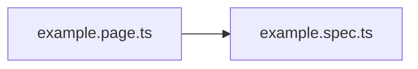

# Instalacja

Żeby móc uruchomić testy trzeba zainstalować Playwright i jego przeglądarki za pomoca komendy:

```bash
npx playwright install
```

# Jak uruchomić testy

## Podstawowe skrypty

**Uruchomienie wszystkich testów w trybie headless:**
```bash
npm run test
```

**Uruchomienie wszystkich testów w trybie z podglądem:**
```bash
npm run test:headed
```

**Uruchomienie poszczególnego speca:**
```bash
npm run test tests/example.spec.ts -- --headed
npm run test tests/example.spec.ts
```

**Wyświetlenie raportu html z testów:**
```bash
npx playwright show-report
```

Domyślnym środowiskiem dla testów jest staging, więc uruchomienie ich na tym envie nie wymaga dodatkowych parametrów.

Żeby uruchomić wszystkie testy na prodzie korzystamy z komendy uzupełnionej o parametr **ENV=prod**

Bash:
```bash
ENV=prod npm run test
```

Powershell:
```powershell
$env:ENV="prod"; npm run test
```

# Tworzenie testów - patterny i konwencje

## Patterny:

 * **Page Object Model**

Tworzymy testy z wykorzystaniem POM - dla danego widoku (page'a) tworzymy klasę (page), w której umieszczamy **lokatory/metody/asercje** należące do danego widoku. Nastepnie tworzymy spec, w którym inicjalizujemy tą klasę i korzystamy z jej zasobów. 



Page trzymamy w katalogu **pages**, pliki testowe spec w katalogu **tests**.

* **AAA**
W spec'ach korzystamy z patternu AAA (Arrange/Act/Assert). Dla czytelności testów dzielimy poszczególne testy na dane/metody wykonawcze/asercje za pomocą komentarzy. (Przykład w snippet'cie)

Snippety dla example.page.ts i example.spec.ts

**example.page.ts**
```typescript
import { Locator, Page, expect } from "@playwright/test";
import { PpgApi } from "../utils/ppgApi.utils";

export class ExamplePage extends PpgApi {

  constructor(page: Page) {
    super(page);
  }

  ppgApi = new PpgApi(this.page);

  exampleElement: Locator = this.page.locator("data-test-id['exampleLocator']");

  async exampleMethod(): Promise<void> {
    await this.exampleElement.click();
  }

  async exampleMethodAssertion(): Promise<void> {
    await expect(this.exampleElement).toBeVisible();
  }
}
```
> W page'u zainicjalizowano ```ppgApi = new PpgApi(this.page);``` Jest to klasa obsługująca możliwość autoryzowanych requestów do API PPG. Przykładowe użycie: ```const response = await this.ppgApi.customPpgRequest("GET", `/aai/user`);```

**example.spec.ts**
```typescript
import { test } from "../playwright/fixtures";
import { ExamplePage } from "../pages/example.page";

test.describe.configure({ mode: "serial" });
test.describe("Example test suite", () => {
  let examplePage: ExamplePage;

  test.beforeEach(async ({ page }) => {
    examplePage = new ExamplePage(page);
    await page.goto("/");
  });

  test("example test", async () => {
    //Arrange
    //const exampleData = 'test';

    //Act
    await examplePage.exampleMethod();

    //Assert
    await examplePage.exampleMethodAssertion();

  });
});
```

# Założenia przy projektowaniu testów

- Inicjalizacje PageObjectu robimy w hook'u beforeEach (potrzebne dla utrzymania contextu page'a)
- Autoryzacja ograna jest w **/playwright/fixtures**. Aby pominąc proces logowania się przez każdy pojedyńczy test, w pliku testowym .spec zamiast defaultowego importu korzystamy z: 
```typescript
import { test } from "../playwright/fixtures";
```
- Aby zachować poprawność procesu zrównoleglenia testów (sekwencyjne wykonywanie testów przez worker), w każdym specu przed pierwszym **test.describe** dodajemy linijkę:
```typescript
test.describe.configure({ mode: "serial" });
```
* Defaultowo testy odpalane są równolegle z wykorzystaniem maksymalnej ilości workerów (ilość workerów = ilość dostępnych threadów/2). Jeśli chcesz odpalić testy na konkretnej liczbie workerów skorzystaj z przykładowej komendy:
```bash
npm run test -- --workers 4
```
- W przypadku globalnych komponentów, które mogą być reużywalne w całym procesie testowym (np. menu nawigacyjne) tworzymy taki component w **/components**. Przykład:
```typescript
import { Page } from "@playwright/test";

export class ExampleComponent {
  constructor(private page: Page) {}

  someLocator = this.page.locator("");
}
```
- Predefiniowane dane testowe trzymamy w **/test-data**.
- Credentialse - konta dla workerów trzymamy w **/test-data/creds.data.ts** (do wyniesienia do zmiennych github).
- Staramy się dzielić specki na pomniejsze describe'y (zamiast pakować wszystko w jeden) - np. 1 describe per komponent dla danego page'a.
- Pojedynczy test nie powinien przekraczać 30 sekund.
- Piszemy testy w pełnej izolacji, tzn. kazdy describe tworzy sobie dane testowe i po sobie sprząta
- Zaleznosci między testami dozwolone jedynie w obrębie tego samego describe'a